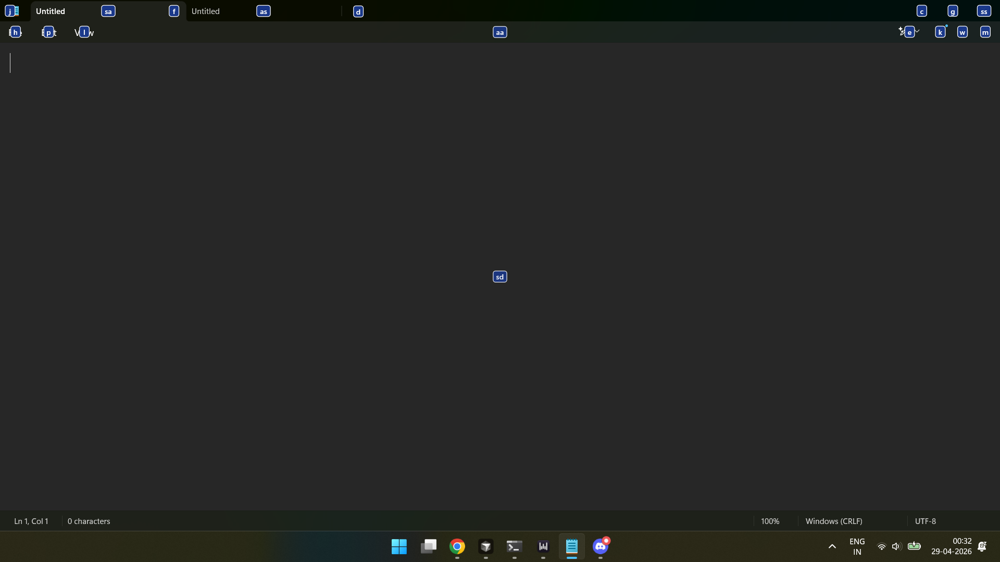
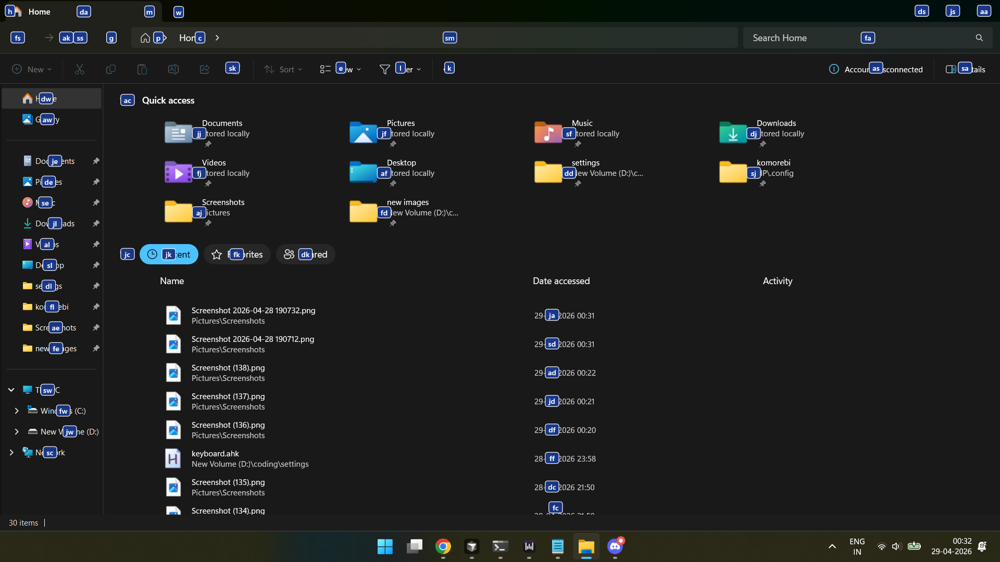

# Navigator v1.0

Press a hotkey. Hints appear. Type letters. Act.

A keyboard-native UI navigator for **Windows**, rewritten in Rust.

## Screenshots

### Notepad

<p align="center">
  
</p>

### File Explorer

<p align="center">
  
</p>

## Credits

Navigator follows the **Hunt-and-Peck** idea from **[zsims](https://github.com/zsims)**’s original project: **[hunt-and-peck](https://github.com/zsims/hunt-and-peck)**. This repo is a **Rust rewrite** of that workflow (see `crates/`); it is not line-by-line ported C#.

Thank you, **zsims**, for the concept and the reference implementation.

## Usage

1. Run **`navigator.exe`** (see **Build**).
2. Focus a normal window (e.g. Notepad or Explorer).
3. Press **`/`** (default hotkey) to open hints. You can set a different chord in `config.toml` under **`[hotkey].chord`** (e.g. `alt+/`).
4. Type the shown letters to filter, then activate the target.

Press **`/`** again while hints are visible to **type in the focused app** (including another **`/`**); hint letters are ignored until you press **Esc**. **Esc** closes the overlay (same as canceling from normal hint mode).

## Build

- **OS:** Windows  
- **Rust:** ≥ 1.85 (`edition = "2024"`)

```powershell
cargo build -p nav-app --release
```

Output: `target/release/navigator.exe`.

### User zip (release layout)

To rebuild the files under `user-space/` and the release zip `navigator-vX.Y.Z-windows-x86_64.zip` (version from `[workspace.package]` in the root `Cargo.toml`; contents: exe, `README.txt`, `LICENSE`, `screenshots/`), from the repo root run:

```powershell
powershell -ExecutionPolicy Bypass -File user-space/package.ps1
```

Generated `navigator.exe`, `LICENSE` copies, `screenshots/`, and `*.zip` in `user-space/` are gitignored; `user-space/README.txt` and `user-space/package.ps1` are versioned.

Developers:

```powershell
git clone <repository-url>
cd navigator
cargo check --workspace
cargo run -p nav-app --bin navigator
```

## Docs

| Audience | Where |
|----------|--------|
| Contributors | [Agent/workflow/README.md](Agent/workflow/README.md) |
| Legacy C# HAP (read-only) | [legacy/](legacy/) |

## License

This Rust workspace is licensed under the **GNU General Public License v3.0 only** — see [`LICENSE`](LICENSE).

The archived Hunt-and-Peck sources under [`legacy/`](legacy/) keep their **original license** as shipped upstream.
